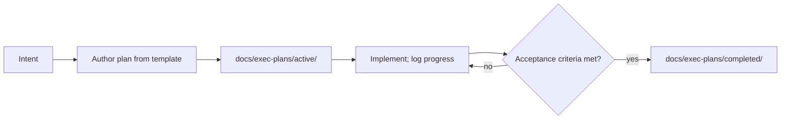

# Execution Plans

English | [中文](PLANS.zh.md)

Execution plans are durable plan documents: the intent, acceptance criteria, task order, and progress log for one unit of work, written before implementation and moved from `active/` to `completed/` whole. They record work, not decisions — decision rationale lives in [Agent Notes](../.agents/notes/README.md). They are working artifacts maintained in English only ([exclusion rationale](i18n/README.md#scope-and-exclusions)).

| Plan | Area | Status |
|---|---|---|
| [Initial project setup](exec-plans/active/2026-08-15-initial-setup.md) | Global — project foundation | in progress |

## Lifecycle

