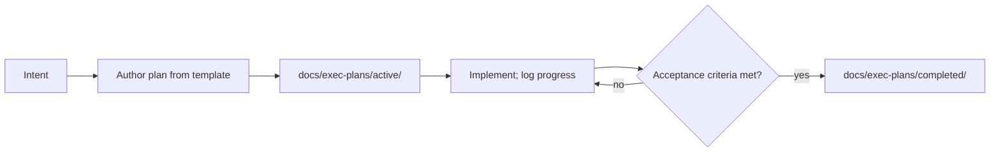

# 执行计划

[English](PLANS.md) | 中文

执行计划（execution plan）是持久的计划文档：一项工作的意图、验收标准、任务顺序和进度日志，先于实现撰写，完成后整体从 `active/` 移入 `completed/`。它记录的是工作，不是决策——决策理由记录在 [Agent Note](../.agents/notes/README.md) 中。执行计划是仅以英文维护的工作产物（[排除理由](i18n/README.md#scope-and-exclusions)）。

| 计划 | 领域 | 状态 |
|---|---|---|
| [Initial project setup](exec-plans/active/2026-08-15-initial-setup.md) | Global — project foundation | in progress |

## 生命周期

