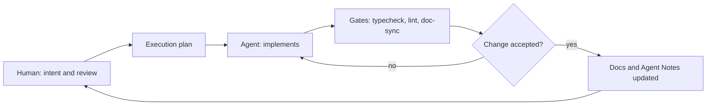

# Product Sense

English | [中文](PRODUCT_SENSE.zh.md)

## Purpose

DeepSeek Harness (`dsh`) composes a model, tools, and a durable session log into an agent a person directs from a terminal or browser. The [architecture map](architecture.md) owns the composition mechanics; this page owns product direction: what dsh is for, what it believes, and what it refuses to be.

## Core beliefs

- Humans steer, agents execute: approval policy, the session log, and readable transcripts make delegation safe to direct and safe to inspect after the fact.
- Everything is a plugin: no capability is privileged, so a deployment replaces any provider — model, filesystem, subprocess, sandbox — from configuration ([architecture](architecture.md)).
- The session log is the single source of model-visible truth: what the model saw can always be reconstructed from durable events ([session log](architecture.md)).
- The agent works where the user's files are: local execution by default, with confinement through the [sandbox seam](../packages/sandbox/sandbox/README.md) when spawned processes need limits.
- Fail loud: misconfiguration and tool failure surface at the earliest resolvable point instead of degrading silently.

## Non-goals

- Not a hosted service: dsh runs on the user's machine or their own infrastructure.
- Not a model-training framework.
- Not a chat product: the Web UI renders and directs agent sessions; conversation is the means, completed work is the end.
- No unreplaceable behavior ships in the product itself; product-owned plugins compete on equal terms with external ones.

## Steering loop

