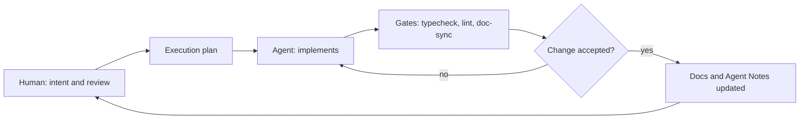

# 产品观

[English](PRODUCT_SENSE.md) | 中文

## 定位

DeepSeek Harness（`dsh`）把模型、工具和持久会话日志组合成一个 agent（智能体），让人可以从终端或浏览器指挥它。[架构总览](architecture.md)负责组合机制；本页负责产品方向：dsh 为了什么、信什么、拒绝成为什么。

## 核心信念

- 人掌舵、agent 执行：审批策略、会话日志和可读的 transcript（会话记录）让委托既可指挥、也可事后审查。
- 一切皆插件：没有任何能力是特权的，部署方可以从配置替换任意 provider——模型、文件系统、子进程、沙箱（[架构](architecture.md)）。
- 会话日志是模型可见事实的唯一真源：模型看到过的内容总能由持久事件重建（[会话日志](architecture.md)）。
- agent 在用户文件所在之处工作：默认本地执行；派生进程需要限制时通过 [sandbox seam](../packages/sandbox/sandbox/README.md) 收紧。
- 失败要响亮：配置错误和工具失败在最早可判定处浮出，绝不静默降级。

## 非目标

- 不是托管服务：dsh 运行在用户机器或其自有基础设施上。
- 不是模型训练框架。
- 不是聊天产品：Web UI 渲染并指挥 agent 会话；对话是手段，完成的工作才是目的。
- 产品自身不发布任何不可替换的行为；产品自有的插件与外部插件同等竞争。

## 掌舵循环

