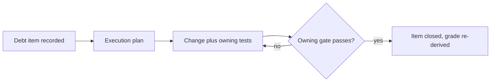

# Quality Score

English | [中文](QUALITY_SCORE.zh.md)

## Domain grades

| Domain | Grade | Basis |
|---|---|---|
| Type safety | A | `strict` TypeScript across packages; `pnpm run typecheck` |
| Behavior coverage | A | per-file 100% coverage gate ([testing](testing.md)) |
| Documentation | A | doc-sync gate: budgets, pairing, links, diagrams ([standard](AGENTS.md)) |
| Runtime reliability | B | defensive-pattern review; no SLO measurement yet ([reliability](RELIABILITY.md)) |
| Security posture | B | sandbox and credential seams enforced; no external audit |

## Rubric

- A: mechanically gated; a regression cannot merge.
- B: enforced by review against a written standard; not fully gated.
- C: documented intent only.
- D: no owner and no standard.

## Debt tracker

| Item | Domain | Note |
|---|---|---|
| (none recorded) | | |

## Grading loop

