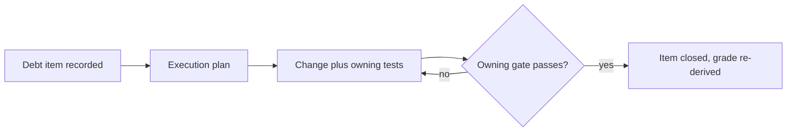

# 质量评分

[English](QUALITY_SCORE.md) | 中文

## 领域评分

| 领域 | 评分 | 依据 |
|---|---|---|
| 类型安全 | A | 各包 `strict` TypeScript；`pnpm run typecheck` |
| 行为覆盖 | A | 逐文件 100% 覆盖率门禁（[测试](testing.md)） |
| 文档 | A | doc-sync 门禁：预算、配对、链接、图（[标准](AGENTS.md)） |
| 运行时可靠性 | B | 按防御性模式评审；尚无 SLO 度量（[可靠性](RELIABILITY.md)） |
| 安全姿态 | B | 沙箱与凭据 seam 已强制；无外部审计 |

## 评分标准

- A：机制化门禁；回归无法合并。
- B：按书面标准靠评审约束；未完全门禁化。
- C：仅有成文意图。
- D：无负责人、无标准。

## 债务跟踪

| 条目 | 领域 | 备注 |
|---|---|---|
| （暂无记录） | | |

## 评分循环

