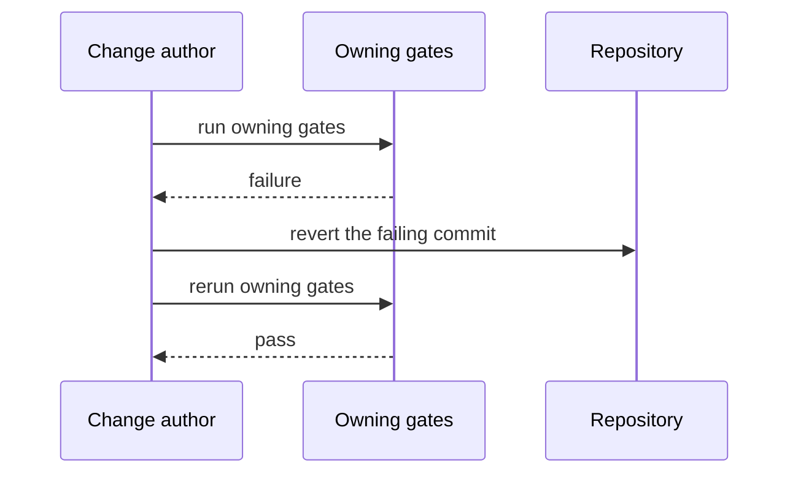

# Reliability

English | [中文](RELIABILITY.zh.md)

## Critical paths

- Durable session persistence: every model-visible fact is appended before it can influence a request ([session-persistence](../packages/session/session-persistence/README.md)).
- Tool execution: cancellation and timeouts unwind in-flight work through the [guarded pipeline](subsystems/tools.md) and the agent handle ([core](subsystems/core.md)).
- Subprocess teardown: spawned process trees are reaped on cancellation or plugin unload ([defensive patterns](defensive-patterns.md)).

## Service objectives

No service SLOs are defined: dsh is a developer preview running on user machines, not a hosted tier. When deployment tiers exist, their targets land here with owners and rollback drills.

## Failure containment

Registrations are reversible effects: a plugin that fails unloads and unwinds its contributions instead of poisoning the tree ([Cordis primer](cordis-primer.md)). Cancellation propagates through agent handles, tool pipelines, and subprocess groups ([defensive patterns](defensive-patterns.md)).

## Rollback

1. Revert the failing commit whole; do not patch forward under pressure.
2. Rerun the owning gates selected by [pre-push checks](../.agents/skills/dsh-pre-push-checks/SKILL.md).
3. Session stores are developer-local and outside repository rollback; no data migration step exists.

