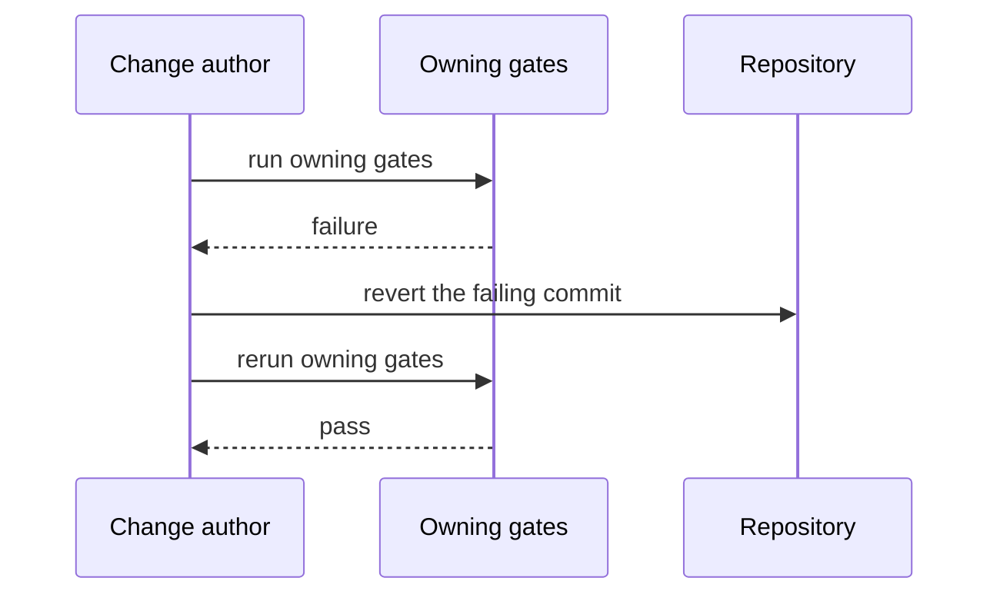

# 可靠性

[English](RELIABILITY.md) | 中文

## 关键路径

- 会话持久落盘：每条模型可见事实先追加进日志，才可能影响请求（[session-persistence](../packages/session/session-persistence/README.md)）。
- 工具执行：取消与超时通过[受保护的执行管道](subsystems/tools.md)和 agent 句柄（[core](subsystems/core.md)）撤销进行中的工作。
- 子进程清理：取消或插件卸载时会收割派生的进程树（[防御性模式](defensive-patterns.md)）。

## 服务目标

未定义服务 SLO：dsh 是运行在用户机器上的开发者预览版，不是托管服务层级。出现部署层级后，其目标与负责人、回滚演练一并落到本页。

## 故障抑制

注册都是可逆副作用：失败的插件会卸载并撤销自己的贡献，不会污染整棵插件树（[Cordis 入门](cordis-primer.md)）。取消沿 agent 句柄、工具管道和子进程组传播（[防御性模式](defensive-patterns.md)）。

## 回滚

1. 整体 revert 出问题的提交；不在压力下带病前向补丁。
2. 重跑 [pre-push checks](../.agents/skills/dsh-pre-push-checks/SKILL.md) 选出的所属门禁。
3. 会话存储是开发者本地的，不在仓库回滚范围内；不存在数据迁移步骤。

