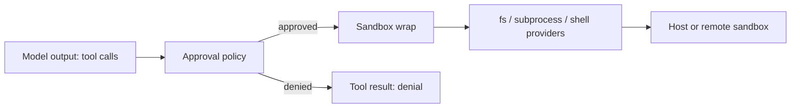

# Security

English | [中文](SECURITY.zh.md)

## Hard invariants

- Credentials never appear in source, logs, or the session log; runtime resolves them through the [credential seam](../packages/credentials/credentials/README.md), and `.env` files stay uncommitted (`.gitignore`).
- Model output reaches the host only through guarded execution: tool calls pass the approval policy, and spawned processes wrap argv with a [sandbox backend](../packages/sandbox/sandbox/README.md) before spawning.
- Data crossing a process, worker, wire, durable-file, or model/tool-JSON boundary is validated at that boundary; same-process typed values are trusted ([standing orders](../AGENTS.md)).
- Raw/Web `cordis.yml` plugins resolve only through their resolver manifest's dependencies, so configuration cannot mount unvetted code paths ([standing orders](../AGENTS.md)).

## Trust zones

## Data classification

| Data | Class | Handling |
|---|---|---|
| Credentials and `.env` values | secret | resolved through the credential seam; never logged, never committed |
| Session events, transcripts, titles | sensitive | durable via the persistence seam; transcripts derive from the log |
| Tool outputs from the user's workspace | sensitive | governed by fs policy and sandbox confinement |
