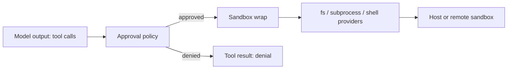

# 安全

[English](SECURITY.md) | 中文

## 硬性不变量

- 凭据绝不进入源码、日志或会话日志；运行时通过 [credential seam](../packages/credentials/credentials/README.md) 解析凭据，`.env` 文件保持不入库（`.gitignore`）。
- 模型输出只有经过受保护的执行才能触达宿主：工具调用先过审批策略，派生进程在 spawn 前用 [sandbox backend](../packages/sandbox/sandbox/README.md) 包装 argv。
- 跨进程、worker、网络、持久化文件或模型/工具 JSON 边界的数据在该边界上校验；同进程内的类型化值受信任（[常备指令](../AGENTS.md)）。
- Raw/Web `cordis.yml` 插件只能经其 resolver manifest 的 dependencies 解析，配置无法挂载未审查的代码路径（[常备指令](../AGENTS.md)）。

## 信任分区

## 数据分级

| 数据 | 级别 | 处理 |
|---|---|---|
| 凭据与 `.env` 值 | 秘密 | 经 credential seam 解析；绝不记日志、绝不入库 |
| 会话事件、transcript、标题 | 敏感 | 经持久化 seam 落盘；transcript 由日志派生 |
| 来自用户工作区的工具输出 | 敏感 | 受 fs 策略与沙箱约束管辖 |
